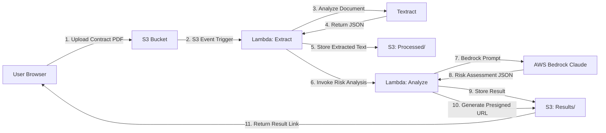

# ContractGuard Contract Risk Assessment Tool (AWS)

**Winner, Amazon Munich Hackathon 2025**


ContractGuard is a serverless contract analysis tool that extracts key clauses from uploaded legal documents, benchmarks them against risk patterns, and explains red flags in plain language using AWS Bedrock's LLM capabilities.

---

## 🚀 Live Demo

**Prototype**: [ContractGuard Demo](https://partyrock.aws/u/Qaazh/LYV2p0ORr/ContractGuard-AI%253A-Risk-Analysis-Assistant)
  
---

## 🏗 Architecture

The serverless architecture leverages AWS managed services for zero-maintenance, event-driven contract analysis:



---

## 🔧 Tech Stack

- **Storage**: Amazon S3 (upload, processed text, results)
- **Compute**: AWS Lambda (Python 3.11)
- **Document Analysis**: Amazon Textract
- **AI/LLM**: AWS Bedrock (Claude 3 Sonnet)
- **Frontend**: Static HTML/JS (S3 + CloudFront) or Flask API

---

## ✨ Features

- **Upload & Extract**: Drag-drop PDF contracts (multiple file formats supported); Textract extracts clauses and metadata
- **Risk Benchmarking**: Bedrock analyzes clauses against legal risk patterns (termination, liability, indemnity, IP rights)
- **Plain Language Explanations**: LLM translates legalese into actionable insights
- **Instant Feedback**: Results returned via presigned S3 URL in <10 seconds

---

## 📂 Repository Structure

```
contract-guard/
├── README.md
├── architecture.md          # Detailed AWS diagram and flow
├── lambda/
│   ├── extract_handler.py   # Textract extraction + S3 storage
│   ├── analyze_handler.py   # Bedrock risk analysis
│   └── requirements.txt
├── frontend/
│   ├── index.html           # Upload UI
│   └── app.js               # S3 presigned upload + result fetch
├── iac/
│   ├── cloudformation.yaml  # IaC for deployment
│   └── terraform/           # Alternative: Terraform modules
└── docs/
    └── demo.md              # Demo walkthrough
```
## 🧪 Use

Upload a sample NDA or service agreement PDF:
1. Navigate to the frontend URL
2. Upload contract → triggers Lambda pipeline
3. View extracted clauses and risk scores in ~8-10 seconds

---

## 🎯 Roadmap

- [ ] Multi-document batch analysis
- [ ] Clause comparison (contract A vs. contract B)
- [ ] Export risk report as PDF
- [ ] Integration with DocuSign API for signed contract analysis

---
