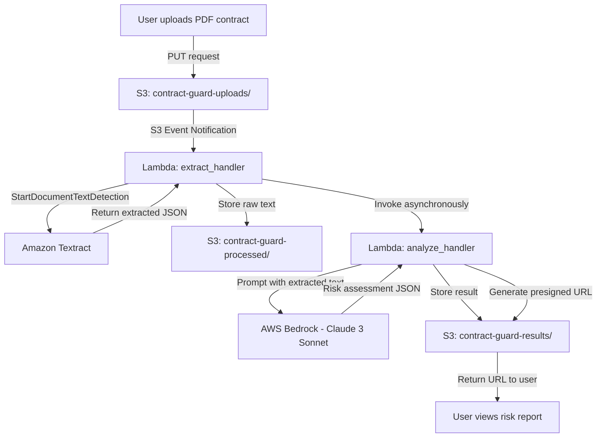

# ContractGuard Architecture

> This document provides detailed technical information about the ContractGuard serverless architecture. For a quick overview, see the [README](README.md).

---

### Folder Responsibilities

| Folder | Purpose | Key Files |
|--------|---------|-----------|
| `lambda/` | Serverless compute handlers | `extract_handler.py`, `analyze_handler.py` |
| `frontend/` | User interface (optional) | `index.html`, `app.js` |
| `iac/` | Automated deployment | `cloudformation.yaml`, `terraform/` |
| `docs/` | Documentation and guides | `demo.md` |

---

## High-Level Architecture

---

## Component Details

### 1. S3 Buckets (Storage Layer)

| Bucket | Purpose | Lifecycle |
|--------|---------|-----------|
| `contract-guard-uploads/` | User-uploaded PDFs | Delete after 7 days |
| `contract-guard-processed/` | Textract extracted text | Delete after 30 days |
| `contract-guard-results/` | Final risk analysis JSON | Delete after 90 days |

**Configuration:**
- Encryption: SSE-S3 (or SSE-KMS for sensitive data)
- Versioning: Disabled (cost optimization)
- Access: Private, presigned URLs only

---

### 2. Lambda: extract_handler (lambda/extract_handler.py)

**Trigger:** S3 PUT event on `uploads/` bucket

**Flow:**
1. Receives S3 event with object key
2. Calls Textract `start_document_text_detection`
3. Polls for job completion (async or callback)
4. Extracts text from JSON response
5. Stores cleaned text to `processed/` bucket
6. Invokes `analyze_handler` asynchronously

**Environment Variables:**
- `UPLOADS_BUCKET` - Source bucket name
- `PROCESSED_BUCKET` - Destination for extracted text
- `TEXTRACT_TIMEOUT` - Max wait time (default: 30s)

**Error Handling:**
- File too large (>10 MB): Return 400 error
- Textract timeout: Retry up to 3 times with exponential backoff
- Parsing errors: Log and store error marker in processed bucket

---

### 3. Lambda: analyze_handler (lambda/analyze_handler.py)

**Trigger:** Manual invocation from `extract_handler`

**Flow:**
1. Read extracted text from `processed/` bucket
2. Build Bedrock prompt with risk analysis instructions
3. Call Bedrock `invoke_model` API (Claude 3 Sonnet)
4. Parse JSON response and validate schema
5. Store result to `results/` bucket
6. Generate presigned GET URL (15-minute TTL)
7. Return URL to caller

**Environment Variables:**
- `PROCESSED_BUCKET` - Source for extracted text
- `RESULTS_BUCKET` - Destination for analysis JSON
- `BEDROCK_MODEL_ID` - Model identifier (default: `anthropic.claude-3-sonnet-20240229-v1:0`)
- `BEDROCK_REGION` - Region where Bedrock is available (default: `us-east-1`)
- `PRESIGNED_TTL` - URL expiry in seconds (default: 900)

**Error Handling:**
- Bedrock throttling (429): Exponential backoff, up to 5 retries
- Bedrock 5xx errors: Retry once, then store "analysis unavailable" result
- Invalid JSON output: Store partial results with warning flag

---

### 4. Amazon Textract

**Service:** Document text extraction

**Configuration:**
- API: `StartDocumentTextDetection` (async, for multi-page PDFs)
- Features: `TABLES`, `FORMS` enabled
- Output: JSON with text blocks, bounding boxes, confidence scores

**Typical Performance:**
- 1-page PDF: ~2-3 seconds
- 10-page PDF: ~5-7 seconds
- 50-page PDF: ~20-30 seconds

---

### 5. AWS Bedrock

---

### 6. Frontend

**Location:** `frontend/` folder

**Components:**
- `index.html` - Drag-drop upload UI
- `app.js` - JavaScript for presigned S3 upload and result polling

**Features:**
- Presigned POST for secure uploads
- Progress bar for upload status
- Automatic result polling (checks every 2s for 30s max)
- Risk level color coding (green/yellow/red)

---

## Data Flow Example

### Step-by-Step: Processing a 5-Page NDA

1. **User Action**: Uploads `sample-nda.pdf` via browser
2. **S3 Upload**: File stored at `s3://contract-guard-uploads/2024-01-15/sample-nda.pdf`
3. **S3 Event**: Triggers `extract_handler` Lambda within 100ms
4. **Textract Call**: Lambda invokes `start_document_text_detection`
5. **Polling**: Lambda polls Textract job status (completes in ~5 seconds)
6. **Text Extraction**: Textract returns JSON with 47 text blocks
7. **Storage**: Cleaned text saved to `s3://contract-guard-processed/2024-01-15/sample-nda.txt` (2.3 KB)
8. **Analysis Trigger**: `extract_handler` invokes `analyze_handler` asynchronously
9. **Bedrock Prompt**: Lambda sends 2,100 tokens to Claude 3 Sonnet
10. **Bedrock Response**
11. **Result Storage**: JSON saved to 
12. **Presigned URL**: Lambda generates 15-minute URL
13. **User Display**: Frontend fetches JSON and renders risk report with color-coded cards

**Total Time:** ~8-10 seconds

---

## Cost Analysis

### Per-Contract Cost Estimate (10-page PDF)

| Service | Usage | Cost |
|---------|-------|------|
| **S3 Storage** | 2 MB upload + 5 KB text + 3 KB JSON (30 days) | $0.001 |
| **S3 Requests** | 3 PUTs + 5 GETs | $0.0001 |
| **Lambda Extract** | 512 MB, 8 seconds runtime | $0.0007 |
| **Lambda Analyze** | 256 MB, 3 seconds runtime | $0.0002 |
| **Textract** | 10 pages text detection | $0.015 |
| **Bedrock** | 2,000 input + 500 output tokens | $0.004 |
| **Data Transfer** | Presigned URL GET (3 KB) | $0.0001 |
| **Total per Contract** | | **~$0.021** |

### Monthly Cost Projection (1,000 contracts)

| Scenario | Contracts/Month | Total Cost |
|----------|----------------|------------|
| Light usage | 100 | $2.10 |
| Moderate usage | 1,000 | $21.00 |
| High usage | 10,000 | $210.00 |

**Cost Optimization Tips:**
- Enable S3 lifecycle policies to delete old objects
- Use Lambda reserved concurrency to limit spend
- Batch smaller documents to reduce Textract per-page costs
- Cache common contract templates

---

## Security Considerations

### Data Protection
- **Encryption at rest**: SSE-S3 on all buckets (upgrade to SSE-KMS for compliance)
- **Encryption in transit**: HTTPS/TLS 1.2+ for all API calls
- **Presigned URLs**: 15-minute TTL, read-only access, no public buckets

### Access Control
- **IAM roles**: Lambda execution role with least privilege
- **S3 bucket policies**: Deny public access, allow only Lambda role
- **Bedrock**: Model access restricted to specific IAM role

### Privacy & Compliance
- **No logging of contract text**: Only log document IDs and metadata
- **PII handling**: Do not store PII in plaintext; consider encryption
- **Data retention**: Lifecycle policies to auto-delete after 90 days
- **Audit trail**: CloudTrail enabled for all S3/Lambda/Bedrock API calls

### Application Security
- **Input validation**: Reject files >10 MB, non-PDF MIME types
- **Rate limiting**: API Gateway throttling (if using frontend)
- **Authentication**: Optional Cognito for user-based access
- **CORS**: Restrict origins to trusted domains only

---
## Roadmap

### Phase 1:
- ✅ PartyRock prototype live
- ✅ Architecture documentation
- ✅ Repository structure

### Phase 2: AWS Serverless Build 
- ✅ Implement `extract_handler.py`
- ✅ Implement `analyze_handler.py`
- ✅ Create CloudFormation template
- ✅ Deploy to personal AWS account

### Phase 3: Frontend
- ✅ Build S3 presigned upload UI
- [ ] Add result polling and display
- [ ] Deploy to S3 + CloudFront

### Phase 4: Enhancements
- [ ] Multi-document batch analysis
- [ ] Clause comparison (contract A vs B)
- [ ] Export risk report as PDF
- [ ] Integration with DocuSign API

---

## Additional Resources

- [AWS Lambda Developer Guide](https://docs.aws.amazon.com/lambda/)
- [Amazon Textract Documentation](https://docs.aws.amazon.com/textract/)
- [AWS Bedrock User Guide](https://docs.aws.amazon.com/bedrock/)
- [Anthropic Claude Prompt Engineering](https://docs.anthropic.com/claude/docs)

---
